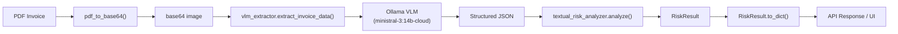
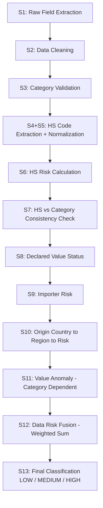

# VLM Extraction + Textual Risk Pipeline — Integration Documentation

## System Architecture



> **IMPORTANT:**
> The two modules have a strict **producer → consumer** relationship. `vlm_extractor` produces structured JSON; `textual_risk_analyzer` consumes it. The analyzer never calls the VLM — it only validates and scores.

---

## Module 1: `vlm_extractor.py`

### Purpose
Sends a base64-encoded invoice image to an Ollama-hosted Vision-Language Model and returns structured JSON with party info, shipment details, per-item categories, and X-ray vision labels.

### Configuration Constants

| Constant | Default Value | Description |
|---|---|---|
| `DEFAULT_OLLAMA_URL` | `http://localhost:11434/api/generate` | Ollama API endpoint |
| `DEFAULT_MODEL` | `ministral-3:14b-cloud` | VLM model tag |
| `DEFAULT_TIMEOUT` | `300` (seconds) | HTTP request timeout |

---

### Public Function: `extract_invoice_data()`

```python
def extract_invoice_data(
    base64_image: str,
    *,
    ollama_url: str = DEFAULT_OLLAMA_URL,
    model:      str = DEFAULT_MODEL,
    timeout:    int = DEFAULT_TIMEOUT,
    prompt:     Optional[str] = None,
) -> Dict[str, Any]
```

#### Parameters

| Parameter | Type | Required | Description |
|---|---|---|---|
| `base64_image` | `str` | ✅ | Base64-encoded JPEG/PNG string (no `data:` URI prefix) |
| `ollama_url` | `str` | ❌ | Override Ollama API endpoint |
| `model` | `str` | ❌ | Override model tag |
| `timeout` | `int` | ❌ | Override request timeout (seconds) |
| `prompt` | `str \| None` | ❌ | Custom extraction prompt. Uses built-in `EXTRACTION_PROMPT` if `None` |

#### Returns

**On success** — a dict matching the output schema below.

**On JSON parse failure** — a dict with error keys:
```json
{
  "_raw_response": "the raw text from the VLM",
  "_error": "Model output was not valid JSON."
}
```

#### Raises

| Exception | When |
|---|---|
| `requests.exceptions.ConnectionError` | Ollama is unreachable |
| `requests.exceptions.Timeout` | Request exceeds timeout |
| `requests.exceptions.HTTPError` | Ollama returns a non-2xx status |

#### JSON Sanitization

The internal `_sanitize_and_parse()` function strips markdown code fences (`` ```json ... ``` ``) from VLM output via regex before parsing. If the output is clean JSON, it passes through untouched.

---

### Output Schema (VLM Response)

This is the JSON contract between `vlm_extractor` and `textual_risk_analyzer`:

```json
{
  "parties": {
    "exporter":  { "name": "string", "country": "string" },
    "consignee": { "name": "string", "country": "string" }
  },
  "shipment_details": {
    "ship_date":  "string",
    "invoice_no": "string",
    "subtotal":   "<number or null>",
    "insurance":  "<number or null>",
    "freight":    "<number or null>",
    "packing":    "<number or null>",
    "handling":   "<number or null>",
    "other":      "<number or null>"
  },
  "extracted_items": [
    {
      "packages":       "<number>",
      "units":          "<number>",
      "net_weight":     "string",
      "uom":            "string",
      "item_name":      "string",
      "category":       "string",
      "hs_code":        "string",
      "origin_country": "string",
      "unit_value":     "<number or null>",
      "total_value":    "<number or null>",
      "vision_label":   "string"
    }
  ]
}
```

> **NOTE:**
> The `category` field is **new** in this version. The LLM is given the full 16-category taxonomy in the prompt and must classify each item. The `textual_risk_analyzer` validates this — it does not re-infer locally.

---

### Category Taxonomy (Embedded in Prompt)

The VLM prompt includes the following taxonomy verbatim. **Must stay in sync** with `CATEGORY_TABLE` in `textual_risk_analyzer.py`.

| Category | Description | Expected HS Chapter |
|---|---|---|
| `Laptop` | Notebooks, MacBooks, Chromebooks, ultrabooks | 84 |
| `Mobile Phone` | Smartphones, iPhones, feature phones | 85 |
| `Electronics` | Tablets, headphones, cameras, TVs, drones, power banks (NOT laptops/phones) | 85 |
| `Clothing` | Finished garments: shirts, jeans, jackets, shoes | 61 |
| `Machinery` | CNC machines, turbines, industrial generators | 84 |
| `Industrial Equipment` | Cranes, forklifts, welding sets | 84 |
| `Food Products` | Rice, spices, snacks, canned food, coffee | 20 |
| `Furniture` | Chairs, tables, sofas, mattresses | 94 |
| `Pharmaceuticals` | Medicines, vaccines, supplements | 30 |
| `Automobile Parts` | Tyres, brakes, engine components | 87 |
| `Cosmetics` | Perfumes, creams, shampoos, lipstick | 33 |
| `Textiles` | Raw fabric: yarn, cotton bales, wool, silk | 52 |
| `Plastic Goods` | PVC products, plastic bottles, casings | 39 |
| `Metal Products` | Steel parts, bolts, wires, pipes | 73 |
| `Toys` | Dolls, puzzles, LEGO, board games | 95 |
| `UNKNOWN` | Fallback when confidence < 80% | 00 |

---

## Module 2: `textual_risk_analyzer.py`

### Purpose
13-stage deterministic Data Risk Engine. Consumes the structured JSON from `vlm_extractor` and produces a composite risk score with full breakdown and audit trace.

### Design Contract

> **IMPORTANT:**
> - Category classification is **delegated entirely to the LLM** (via `vlm_extractor`)
> - This module only **validates** the LLM-provided category against `CATEGORY_TABLE`
> - No local keyword inference. Bad/missing LLM category → `UNKNOWN`
> - `CATEGORY_TABLE`, `HS_RISK_TABLE`, `COUNTRY_REGION_TABLE` are **immutable** at runtime

---

### Public API

#### Class: `TextualRiskAnalyzer`

```python
class TextualRiskAnalyzer:
    def analyze(self, vlm_output: Dict[str, Any]) -> RiskResult
```

##### `analyze(vlm_output)`

| Parameter | Type | Description |
|---|---|---|
| `vlm_output` | `Dict[str, Any]` | The parsed dict returned by `extract_invoice_data()` |

**Returns:** `RiskResult` dataclass

---

#### Helper Function: `validate_category()`

```python
def validate_category(llm_category: Any) -> str
```

Accepts the LLM-provided category string. Returns the exact `CATEGORY_TABLE` key if matched (case-insensitive fallback supported), otherwise `"UNKNOWN"`.

---

### Data Classes

#### `RiskResult`

```python
@dataclass
class RiskResult:
    Data_Risk:  float          # Composite score in [0, 1]
    risk_level: str            # "LOW" | "MEDIUM" | "HIGH"
    breakdown:  RiskBreakdown
    context:    RiskContext
    trace:      List[Dict]     # Full 13-stage audit trace
```

Call `result.to_dict()` to get a plain JSON-serializable dict.

#### `RiskBreakdown`

```python
@dataclass
class RiskBreakdown:
    value_anomaly:  float   # 0-1, financial consistency
    hs_code_risk:   float   # 0-1, regulatory alignment
    importer_risk:  float   # 0-1, importer trust baseline
    country_risk:   float   # 0-1, origin geopolitical risk
```

#### `RiskContext`

```python
@dataclass
class RiskContext:
    origin:            str
    region:            str              # "LOW" | "MEDIUM" | "HIGH"
    declared_status:   str              # "VALID" | "MISSING" | "INVALID"
    declared_value:    Optional[float]
    total_min:         Optional[float]  # Expected price window lower bound
    total_max:         Optional[float]  # Expected price window upper bound
    hs_codes_used:     List[str]        # 2-digit HS chapters
    items:             List[Dict]       # Cleaned item summaries
    consistency_flags: List[Dict]       # HS <-> Category mismatches
```

---

### `to_dict()` Output Schema

```json
{
  "Data_Risk": 0.5400,
  "risk_level": "MEDIUM",
  "breakdown": {
    "value_anomaly": 0.0000,
    "hs_code_risk": 0.5500,
    "importer_risk": 0.5000,
    "country_risk": 0.5000
  },
  "context": {
    "origin": "China",
    "region": "MEDIUM",
    "declared_status": "VALID",
    "declared_value": 320000,
    "total_min": 201000.0,
    "total_max": 550000.0,
    "hs_codes_used": ["84", "61"],
    "items": [
      {
        "item_name": "macbook pro 16-inch",
        "quantity": 5.0,
        "category": "Laptop",
        "hs_code_raw": "8471.30"
      }
    ],
    "consistency_flags": []
  }
}
```

---

### The 13-Stage Risk Pipeline



#### Stage-by-Stage Breakdown

| Stage | Name | What It Does |
|---|---|---|
| **S1** | Raw Field Extraction | Pulls `parties`, `shipment_details`, `extracted_items` from VLM output |
| **S2** | Data Cleaning | Normalizes names to lowercase, drops items with qty <= 0, prefers `units` over `packages`, derives subtotal from line items if missing |
| **S3** | Category Validation | Validates LLM-provided `category` against `CATEGORY_TABLE`. Invalid -> `UNKNOWN` |
| **S4+S5** | HS Code Extraction + Normalization | Extracts first 2 digits from raw HS codes (`8471.30` -> `84`). Falls back to category's expected HS chapter if unparseable |
| **S6** | HS Risk Calculation | Looks up each 2-digit chapter in `HS_RISK_TABLE`. Averages across all items |
| **S7** | HS vs Category Consistency | Checks if declared HS chapter matches the expected chapter for the item's category. Each mismatch -> +0.2 penalty |
| **S8** | Declared Value Status | Classifies `subtotal` as `VALID`, `MISSING`, or `INVALID` (<=0) |
| **S9** | Importer Risk | Fixed `0.5` (neutral baseline — no historical data) |
| **S10** | Origin Country | Resolves origin(s) -> region -> risk score. Multiple distinct origins -> `"Mixed"` -> HIGH risk |
| **S11** | Value Anomaly | Builds expected price window (`CATEGORY_TABLE.min * qty` to `max * qty`). Under-declaration or over-declaration -> anomaly score. UNKNOWN items dampen by x0.7 |
| **S12** | Data Risk Fusion | Weighted sum: `0.3*value + 0.3*HS + 0.2*importer + 0.2*country` |
| **S13** | Final Classification | `>= 0.7` -> HIGH, `>= 0.4` -> MEDIUM, else LOW |

---

### System Lookup Tables

#### `CATEGORY_TABLE` — Price Ranges & Expected HS

| Category | Min (INR) | Max (INR) | Expected HS |
|---|---|---|---|
| Laptop | 40,000 | 100,000 | 84 |
| Mobile Phone | 10,000 | 80,000 | 85 |
| Electronics | 5,000 | 50,000 | 85 |
| Clothing | 200 | 5,000 | 61 |
| Machinery | 50,000 | 1,000,000 | 84 |
| Industrial Equipment | 10,000 | 500,000 | 84 |
| Food Products | 100 | 2,000 | 20 |
| Furniture | 2,000 | 50,000 | 94 |
| Pharmaceuticals | 500 | 20,000 | 30 |
| Automobile Parts | 1,000 | 100,000 | 87 |
| Cosmetics | 200 | 10,000 | 33 |
| Textiles | 500 | 20,000 | 52 |
| Plastic Goods | 300 | 15,000 | 39 |
| Metal Products | 1,000 | 50,000 | 73 |
| Toys | 100 | 5,000 | 95 |
| UNKNOWN | 1,000 | 1,000,000 | 00 |

#### `COUNTRY_REGION_TABLE` — Origin Risk Tiers

| Tier | Countries | Risk Score |
|---|---|---|
| **LOW** (0.2) | USA, Germany, Japan, UK, Canada, France, Australia, South Korea, Netherlands, Sweden | 0.2 |
| **MEDIUM** (0.5) | UAE, India, Singapore, China, Brazil, Mexico, Turkey, Malaysia, Thailand | 0.5 |
| **HIGH** (0.7) | Unknown, Mixed, North Korea, Iran, Afghanistan, Syria | 0.7 |

#### Risk Fusion Weights

| Component | Weight | Description |
|---|---|---|
| Value Anomaly | 30% | Financial consistency |
| HS Code Risk | 30% | Regulatory alignment |
| Importer Risk | 20% | Trust baseline (fixed 0.5) |
| Country Risk | 20% | Geopolitical origin risk |

---

## Backend Integration Pattern

### Expected Endpoint Implementation

```python
# routes/risk.py (or equivalent)

from vlm_extractor import extract_invoice_data
from textual_risk_analyzer import TextualRiskAnalyzer

analyzer = TextualRiskAnalyzer()


# --- ENDPOINT: Full Pipeline (PDF -> VLM -> Risk) ---
@app.post("/api/v1/analyze-invoice")
async def analyze_invoice(file: UploadFile):
    """
    Full pipeline: PDF upload -> VLM extraction -> Risk analysis.
    
    Input:  PDF file (multipart/form-data)
    Output: { vlm_result, risk_result }
    """
    pdf_bytes = await file.read()
    b64_image, _ = pdf_to_base64(pdf_bytes)
    
    # Stage 1: VLM extraction
    vlm_result = extract_invoice_data(b64_image)
    if "_error" in vlm_result:
        raise HTTPException(400, detail=vlm_result["_error"])
    
    # Stage 2: Risk analysis
    risk = analyzer.analyze(vlm_result)
    
    return {
        "vlm_result":  vlm_result,
        "risk_result": risk.to_dict(),
    }


# --- ENDPOINT: Risk-Only (pre-extracted JSON -> Risk) ---
@app.post("/api/v1/analyze-risk")
async def analyze_risk(vlm_output: dict):
    """
    Risk analysis only — accepts pre-extracted VLM JSON.
    
    Input:  JSON body matching VLM output schema
    Output: RiskResult dict
    """
    risk = analyzer.analyze(vlm_output)
    return risk.to_dict()


# --- ENDPOINT: VLM Extraction Only ---
@app.post("/api/v1/extract-invoice")
async def extract_invoice(file: UploadFile):
    """
    VLM extraction only — no risk analysis.
    
    Input:  PDF file (multipart/form-data)
    Output: Structured VLM JSON
    """
    pdf_bytes = await file.read()
    b64_image, _ = pdf_to_base64(pdf_bytes)
    
    result = extract_invoice_data(b64_image)
    if "_error" in result:
        raise HTTPException(400, detail=result["_error"])
    
    return result
```

---

### Minimal Usage Example

```python
from vlm_extractor import extract_invoice_data
from textual_risk_analyzer import TextualRiskAnalyzer
import fitz, base64

# 1. Convert PDF -> base64
doc = fitz.open("invoice.pdf")
pix = doc[0].get_pixmap(matrix=fitz.Matrix(2, 2))
b64 = base64.b64encode(pix.tobytes("jpeg", jpg_quality=90)).decode()
doc.close()

# 2. Extract structured data via VLM
vlm_data = extract_invoice_data(b64)

# 3. Run risk analysis
analyzer = TextualRiskAnalyzer()
risk = analyzer.analyze(vlm_data)

# 4. Access results
print(risk.risk_level)           # "LOW" | "MEDIUM" | "HIGH"
print(risk.Data_Risk)            # 0.0 - 1.0
print(risk.breakdown.country_risk)
print(risk.to_dict())            # Full JSON-serializable output
```

---

### Error Handling Reference

| Scenario | Indicator | Recommended Action |
|---|---|---|
| VLM parse failure | `"_error"` key in result dict | Return 400, log raw response |
| Ollama unreachable | `ConnectionError` raised | Return 503, user message: "Start Ollama" |
| VLM timeout | `Timeout` raised | Return 504, suggest smaller document |
| Invalid category from LLM | Silently mapped to `"UNKNOWN"` | No action needed — pipeline handles it |
| Missing subtotal | Status = `"MISSING"`, value_anomaly fallback = 0.3 | Logged in trace, no action needed |
| Missing HS code | Falls back to category's expected HS chapter | Logged in trace, no action needed |
| Unknown origin country | Maps to `"HIGH"` risk region | Flagged in context output |
| Multiple origin countries | Resolved as `"Mixed"` -> HIGH risk | Flagged in context output |
