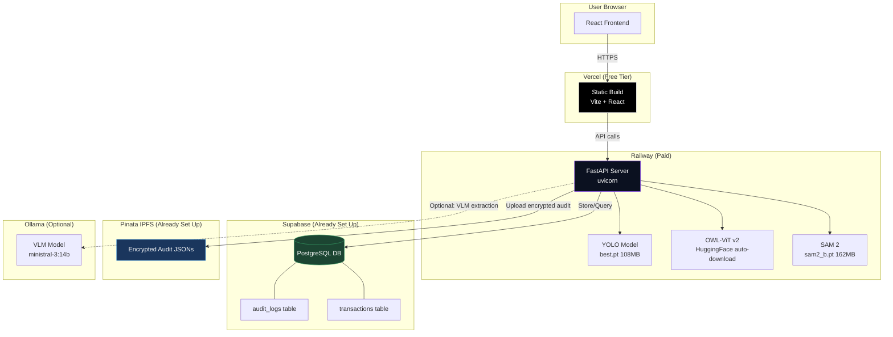

# 🚀 Pixel Platform — Complete Deployment Guide

> **Goal:** Deploy Pixel's React frontend on **Vercel** and the FastAPI backend + ML models on **Railway**, with Supabase and Pinata already in place.

---

## Table of Contents

1. [Current Project Audit](#1-current-project-audit)
2. [Deployed Architecture](#2-deployed-architecture)
3. [Pre-Deployment: Folder & File Changes](#3-pre-deployment-folder--file-changes)
4. [Security Hardening](#4-security-hardening)
5. [Backend Dockerfile](#5-backend-dockerfile)
6. [Model File Strategy](#6-model-file-strategy)
7. [Code Changes Required](#7-code-changes-required)
8. [Step-by-Step: Deploy Backend to Railway](#8-step-by-step-deploy-backend-to-railway)
9. [Step-by-Step: Deploy Frontend to Vercel](#9-step-by-step-deploy-frontend-to-vercel)
10. [Environment Variables Reference](#10-environment-variables-reference)
11. [Post-Deployment Verification](#11-post-deployment-verification)
12. [CI/CD Pipeline (Optional)](#12-cicd-pipeline-optional)
13. [Pre-Deployment Checklist](#13-pre-deployment-checklist)

---

## 1. Current Project Audit

After reading every file and folder in the repo, here are the **critical issues** that must be fixed before deployment:

### 🔴 Critical Issues

| # | Issue | Location | Impact |
|---|-------|----------|--------|
| 1 | **Hardcoded secrets committed to Git** | `Model_Backend/.env` contains real Supabase URL, Key, Encryption key | 🔒 Anyone with repo access can see your DB credentials |
| 2 | **Pinata JWT committed to Git** | `JWT_PINNATA.txt` in repo root | 🔒 Full access to your IPFS uploads |
| 3 | **Giant model files (270+ MB) in repo** | `Model_Backend/model/best.pt` (108 MB), `Model_Backend/utils/sam2_b.pt` (162 MB), `Model_Backend/sam2_b.pt` (162 MB duplicate!) | ❌ GitHub rejects pushes >100 MB; Railway build will be very slow |
| 4 | **`requests` not in requirements.txt** | `Model_Backend/requirements.txt` | ❌ `ipfs_client.py`, `supabase_client.py`, and `vlm_extractor.py` all use `requests` but it's not listed |
| 5 | **`cryptography` not in requirements.txt** | `Model_Backend/requirements.txt` | ❌ `encryption.py` uses `cryptography.fernet` but it's not listed |
| 6 | **`python-dotenv` not in requirements.txt** | `Model_Backend/requirements.txt` | ⚠️ `.env` loading silently skipped if not installed |
| 7 | **`supabase-py` not needed but raw REST used** | `supabase_client.py` makes raw `requests` calls | ✅ Correct approach — no extra SDK needed |
| 8 | **VLM extractor hits `localhost:11434` (Ollama)** | `vlm_extractor.py` line 30 | ⚠️ Ollama won't exist on Railway — needs env var or graceful skip |
| 9 | **`sam2_b.pt` duplicated in two locations** | `Model_Backend/sam2_b.pt` AND `Model_Backend/utils/sam2_b.pt` | 💾 324 MB wasted |
| 10 | **Outputs folder has 294 cached images** | `Model_Backend/outputs/` | 💾 These are runtime artifacts, not source code |
| 11 | **Audit logs (26 JSON files) in repo** | `Model_Backend/audit_logs/` | ⚠️ Runtime data shouldn't be in Git |
| 12 | **No PINATA_JWT env var in `.env`** | `Model_Backend/.env` only has SUPABASE + ENCRYPTION | ❌ IPFS uploads will fail silently |

### 🟡 Warnings

| # | Issue | Impact |
|---|-------|--------|
| 1 | CORS is set to `allow_origins=["*"]` | Works but insecure in production |
| 2 | No `Procfile` or `railway.toml` for Railway | Need to add |
| 3 | No `.dockerignore` | Docker builds will copy unnecessary files |
| 4 | Frontend `.env.example` exists but no `.env` for production | Need to configure on Vercel |
| 5 | `dist/` folder exists in Frontend — should be gitignored and rebuilt on Vercel | Not source code |
| 6 | `PIDray-main/` and `cargoxray-master/` are research folders — not needed for deployment | Extra weight |

---

## 2. Deployed Architecture



### Traffic Flow

```
Browser → Vercel (static HTML/JS/CSS)
       → Railway (API calls to /api/*)
              → Supabase (DB read/write)
              → Pinata (IPFS upload)
              → Ollama (if VLM configured, optional)
```

---

## 3. Pre-Deployment: Folder & File Changes

### 3.1 Files/Folders You Need to CREATE

```
Pixel/
├── Model_Backend/
│   ├── Dockerfile                 ← NEW (Railway needs this)
│   ├── .dockerignore              ← NEW (ignore junk during build)
│   ├── railway.toml               ← NEW (Railway config)
│   ├── .env.example               ← NEW (template for env vars)
│   └── requirements.txt           ← MODIFY (add missing deps)
├── Frontend/
│   └── vercel.json                ← NEW (Vercel rewrite config)
└── .gitignore                     ← MODIFY (fix secrets & large files)
```

### 3.2 Files/Folders You Need to DELETE or Gitignore

> [!CAUTION]
> Do NOT delete these files if you still need them locally. Just ensure they are in `.gitignore` and not pushed to Git.

| Path | Action | Reason |
|------|--------|--------|
| `Model_Backend/.env` | **GITIGNORE** (already is, but verify) | Contains real secrets |
| `JWT_PINNATA.txt` | **DELETE from Git history** | Secrets committed |
| `Model_Backend/model/best.pt` | **GITIGNORE** + use Git LFS or cloud storage | 108 MB — too large for Git |
| `Model_Backend/sam2_b.pt` | **DELETE** (duplicate) | 162 MB duplicate of `utils/sam2_b.pt` |
| `Model_Backend/utils/sam2_b.pt` | **GITIGNORE** + use Git LFS or cloud storage | 162 MB — too large for Git |
| `Model_Backend/outputs/` | **GITIGNORE** (already is) | Runtime artifacts |
| `Model_Backend/audit_logs/` | **GITIGNORE** (already is) | Runtime artifacts |
| `Frontend/dist/` | **GITIGNORE** (already is) | Build output |
| `Frontend/node_modules/` | **GITIGNORE** (already is) | Dependencies |
| `PIDray-main/` | Consider removing from deployment | Research data, not needed at runtime |
| `cargoxray-master/` | Consider removing from deployment | Research data, not needed at runtime |
| `xray_v14/` | Consider removing from deployment | Training results, not needed at runtime |
| `testing/` | Consider removing from deployment | Local test scripts |

### 3.3 Updated `.gitignore` (Root)

Add these lines to your root `.gitignore`:

```gitignore
# ── Secrets (CRITICAL) ──────────────────────────
.env
*.env
Model_Backend/.env
JWT_PINNATA.txt

# ── Large Model Files ───────────────────────────
*.pt
*.pth
*.onnx
*.bin
*.safetensors

# ── Runtime Artifacts ───────────────────────────
Model_Backend/audit_logs/
Model_Backend/outputs/
Model_Backend/test_images/

# ── Build Outputs ───────────────────────────────
Frontend/dist/
Frontend/node_modules/

# ── Python ──────────────────────────────────────
__pycache__/
*.pyc
.venv/
*.egg-info/

# ── Research Folders (optional — exclude from deploy) ──
# PIDray-main/
# cargoxray-master/
# xray_v14/
```

---

## 4. Security Hardening

### 4.1 Rotate ALL Compromised Secrets

> [!CAUTION]
> Your Supabase key, Encryption key, and Pinata JWT are ALL visible in Git history. Even if you delete them now, they exist in previous commits. **You MUST rotate these keys.**

| Secret | Where to Rotate | Steps |
|--------|----------------|-------|
| **Supabase anon key** | [Supabase Dashboard](https://supabase.com/dashboard) → Settings → API | Regenerate the `anon` key. Update Railway env vars. |
| **Encryption Key** | Generate locally | Run: `python -c "from cryptography.fernet import Fernet; print(Fernet.generate_key().decode())"` |
| **Pinata JWT** | [Pinata Dashboard](https://app.pinata.cloud/developers/api-keys) | Revoke old key, create new one. Update Railway env vars. |

### 4.2 Remove Secrets from Git History

After rotating keys, clean the Git history:

```bash
# Option 1: BFG Repo Cleaner (easier)
# Download BFG from https://rtyley.github.io/bfg-repo-cleaner/
bfg --delete-files JWT_PINNATA.txt
bfg --replace-text passwords.txt  # file listing old secrets to redact

# Option 2: Nuclear option — if repo is private and small
# Just create a fresh repo with a clean initial commit
```

### 4.3 CORS Lockdown (In `main.py`)

Currently:
```python
app.add_middleware(
    CORSMiddleware,
    allow_origins=["*"],  # ← DANGEROUS in production
    ...
)
```

Change to:
```python
import os

ALLOWED_ORIGINS = os.environ.get("ALLOWED_ORIGINS", "http://localhost:5173").split(",")

app.add_middleware(
    CORSMiddleware,
    allow_origins=ALLOWED_ORIGINS,
    allow_credentials=True,
    allow_methods=["*"],
    allow_headers=["*"],
)
```

Then set `ALLOWED_ORIGINS=https://your-app.vercel.app` in Railway environment variables.

---

## 5. Backend Dockerfile

> [!IMPORTANT]
> Create this file at `Model_Backend/Dockerfile`. This is the core of your Railway deployment.

```dockerfile
# ─────────────────────────────────────────────────────────────────────────
# Pixel Backend — Production Dockerfile
# ─────────────────────────────────────────────────────────────────────────

# Use slim Python image to reduce size
FROM python:3.11-slim

# Install system dependencies needed by OpenCV, PyMuPDF, etc.
RUN apt-get update && apt-get install -y --no-install-recommends \
    libgl1-mesa-glx \
    libglib2.0-0 \
    libsm6 \
    libxext6 \
    libxrender-dev \
    libgomp1 \
    curl \
    && rm -rf /var/lib/apt/lists/*

# Set working directory
WORKDIR /app

# Copy requirements first (Docker layer caching)
COPY requirements.txt .

# Install Python dependencies
# --no-cache-dir reduces image size
# torch CPU-only saves ~1.5 GB vs CUDA version
RUN pip install --no-cache-dir --upgrade pip && \
    pip install --no-cache-dir \
        torch torchvision --index-url https://download.pytorch.org/whl/cpu && \
    pip install --no-cache-dir -r requirements.txt

# Copy application code
COPY . .

# Create runtime directories
RUN mkdir -p /app/outputs /app/audit_logs /app/model

# Expose port (Railway will auto-detect or use $PORT)
EXPOSE 8000

# Health check
HEALTHCHECK --interval=30s --timeout=10s --start-period=60s --retries=3 \
    CMD curl -f http://localhost:8000/api/health || exit 1

# Start the server
# Railway sets $PORT automatically; default to 8000
CMD ["sh", "-c", "uvicorn main:app --host 0.0.0.0 --port ${PORT:-8000}"]
```

### `.dockerignore` (Create at `Model_Backend/.dockerignore`)

```dockerignore
# Python
__pycache__/
*.pyc
.venv/
.pytest_cache/

# IDE
.vscode/
.idea/

# Git
.git/
.gitignore

# Runtime artifacts (will be created at runtime)
outputs/
audit_logs/

# Test data
test_images/
tests/

# Documentation
*.md
docs/

# Duplicate model file
sam2_b.pt

# Misc
*.log
.env.example
```

### `railway.toml` (Create at `Model_Backend/railway.toml`)

```toml
[build]
builder = "DOCKERFILE"
dockerfilePath = "./Dockerfile"

[deploy]
startCommand = "uvicorn main:app --host 0.0.0.0 --port ${PORT:-8000}"
healthcheckPath = "/api/health"
healthcheckTimeout = 120
restartPolicyType = "ON_FAILURE"
restartPolicyMaxRetries = 5
```

---

## 6. Model File Strategy

Your ML models total **~270 MB** — too large for Git and slow for Docker builds. Here are your options:

### Option A: Railway Volume (Recommended for Your Scale) ⭐

Railway supports persistent volumes. Upload models once, mount into container.

```
1. In Railway Dashboard → Service → Settings → Add Volume
2. Mount path: /app/model_data
3. Deploy once with a script that downloads models into the volume
4. Subsequent deploys use the cached models
```

Set these env vars in Railway:
```
MODEL_PATH=/app/model_data/best.pt
SAM_MODEL_PATH=/app/model_data/sam2_b.pt
```

### Option B: Download on Startup

Add a startup script that downloads models from a URL (Google Drive, Hugging Face, etc.):

```python
# download_models.py — run before uvicorn
import os
import urllib.request

MODELS = {
    "model/best.pt": "https://your-storage.com/best.pt",
    "utils/sam2_b.pt": "https://your-storage.com/sam2_b.pt",
}

for path, url in MODELS.items():
    if not os.path.exists(path):
        print(f"Downloading {path}...")
        urllib.request.urlretrieve(url, path)
        print(f"✓ {path} downloaded")
```

Update Dockerfile CMD:
```dockerfile
CMD ["sh", "-c", "python download_models.py && uvicorn main:app --host 0.0.0.0 --port ${PORT:-8000}"]
```

### Option C: Git LFS

```bash
# Install Git LFS
git lfs install

# Track large files
git lfs track "*.pt"
git lfs track "*.pth"

# This creates .gitattributes
git add .gitattributes
git commit -m "Track model files with Git LFS"
```

> [!WARNING]
> Git LFS has bandwidth limits on free tiers (GitHub: 1 GB/month). Railway pulls from Git on every deploy, which counts against your LFS quota.

### Recommendation

For your project: **Option A (Railway Volume)** is best. Upload `best.pt` and `sam2_b.pt` once to the volume. Zero bandwidth cost on subsequent deploys.

---

## 7. Code Changes Required

### 7.1 Fix `requirements.txt`

Add the missing dependencies:

```diff
 # ── Web server ──────────────────────────────────
 fastapi>=0.110.0
 uvicorn[standard]>=0.27.0
 python-multipart>=0.0.6

+# ── Environment ─────────────────────────────────
+python-dotenv>=1.0.0

 # ── ML / inference ─────────────────────────────
 ultralytics
 opencv-python-headless
 Pillow
 numpy
 torch
 torchvision
 transformers>=4.35.0

 # ── PDF manifest extraction ────────────────────
 pdfplumber>=0.11.0
 fpdf2

 # ── Data / utilities ───────────────────────────
 matplotlib
 pandas>=2.0.0
 scikit-image>=0.22.0
 # -- VLM invoice extraction & async HTTP ----------
 pymupdf>=1.24.0
 httpx>=0.27.0

+# ── External services ──────────────────────────
+requests>=2.31.0
+cryptography>=42.0.0
```

### 7.2 Add `ALLOWED_ORIGINS` to `main.py`

```python
# Replace lines 153-159 in main.py
import os

ALLOWED_ORIGINS = os.environ.get(
    "ALLOWED_ORIGINS", 
    "http://localhost:5173,http://localhost:3000"
).split(",")

app.add_middleware(
    CORSMiddleware,
    allow_origins=ALLOWED_ORIGINS,
    allow_credentials=True,
    allow_methods=["*"],
    allow_headers=["*"],
)
```

### 7.3 Make SAM Model Path Configurable

In `utils/zero_shot_inspector.py`, the `SAM_MODEL_ID` is hardcoded to `"sam2_b.pt"`:

```python
# Line 54 — change to:
SAM_MODEL_ID = os.environ.get("SAM_MODEL_PATH", "sam2_b.pt")
```

And add `import os` at the top if not already there.

### 7.4 Make VLM Extractor URL Configurable

In `vlm_extractor.py` (root-level), it uses `localhost:11434`:

```python
# Line 30 — change to:
DEFAULT_OLLAMA_URL = os.environ.get("OLLAMA_URL", "http://localhost:11434/api/generate")
```

> [!NOTE]
> If you're NOT deploying Ollama to Railway, the VLM extraction will gracefully skip (it's already wrapped in try/except in `main.py`). This is fine — pdfplumber fallback will handle manifests.

### 7.5 Frontend: Add `vercel.json` for API Rewrites

Create `Frontend/vercel.json`:

```json
{
  "rewrites": [
    {
      "source": "/api/:path*",
      "destination": "https://your-railway-backend-url.railway.app/api/:path*"
    }
  ]
}
```

> [!IMPORTANT]
> After deploying the backend on Railway, you'll get a URL like `https://pixel-backend-production.up.railway.app`. Replace `your-railway-backend-url.railway.app` with that URL.

### 7.6 Frontend: Alternative — Use `VITE_API_BASE_URL`

Instead of the rewrite approach, you can set a Vercel environment variable:

```
VITE_API_BASE_URL=https://your-railway-backend-url.railway.app
```

This is already supported by your `analyze.js`:
```javascript
export function getApiBaseUrl() {
  const base = import.meta.env.VITE_API_BASE_URL;
  if (!base) return '';
  return base.replace(/\/+$/, '');
}
```

> **Choose ONE approach** — either `vercel.json` rewrites OR `VITE_API_BASE_URL`. The `VITE_API_BASE_URL` approach is simpler and recommended.

### 7.7 Create `Model_Backend/.env.example`

```env
# ── Supabase ─────────────────────────────────────
SUPABASE_URL=https://your-project.supabase.co
SUPABASE_KEY=your_supabase_anon_key

# ── Encryption ───────────────────────────────────
ENCRYPTION_KEY=your_fernet_32byte_base64_key

# ── Pinata IPFS ──────────────────────────────────
PINATA_JWT=your_pinata_jwt_token
PINATA_GATEWAY_URL=https://gateway.pinata.cloud/ipfs

# ── Model Paths (optional) ──────────────────────
MODEL_PATH=model/best.pt
SAM_MODEL_PATH=sam2_b.pt

# ── CORS (comma-separated origins) ──────────────
ALLOWED_ORIGINS=http://localhost:5173,https://your-app.vercel.app

# ── Feature Flags ───────────────────────────────
ENABLE_ZERO_SHOT=1

# ── Optional: External SHAP microservice ────────
# SHAP_SERVICE_URL=https://your-shap-ngrok.ngrok.io/explain

# ── Optional: VLM/Ollama ────────────────────────
# OLLAMA_URL=http://localhost:11434/api/generate
```

---

## 8. Step-by-Step: Deploy Backend to Railway

### Prerequisites
- Railway account ([railway.app](https://railway.app))
- GitHub repo pushed (without secrets!)
- Model files available for upload

### Step 1: Create Railway Project

```
1. Go to https://railway.app/new
2. Click "Deploy from GitHub Repo"
3. Connect your GitHub account → select your Pixel repo
4. Railway will detect the monorepo — set Root Directory to: Model_Backend
```

### Step 2: Configure Build Settings

```
In Railway Dashboard → Service → Settings:

  Root Directory:       Model_Backend
  Builder:              Dockerfile  (it should auto-detect)
  Dockerfile Path:      ./Dockerfile
  Watch Paths:          /Model_Backend/**
```

### Step 3: Add Environment Variables

Go to **Service → Variables** tab and add ALL of these:

```
SUPABASE_URL          = https://ghozjgstdqgwvpydmhsp.supabase.co
SUPABASE_KEY          = <YOUR_NEW_ROTATED_KEY>
ENCRYPTION_KEY        = <YOUR_NEW_ROTATED_KEY>
PINATA_JWT            = <YOUR_NEW_ROTATED_JWT>
PINATA_GATEWAY_URL    = https://gateway.pinata.cloud/ipfs
MODEL_PATH            = model/best.pt
ALLOWED_ORIGINS       = https://your-frontend.vercel.app
ENABLE_ZERO_SHOT      = 1
PORT                  = 8000
```

### Step 4: Add a Volume for Model Files

```
1. Service → Settings → Volumes → Add Volume
2. Mount Path: /app/model
3. After first deploy, upload files via Railway CLI:
   
   railway link
   railway volume upload model/best.pt /app/model/best.pt
```

Or use the startup download script approach.

### Step 5: Deploy

```
1. Push your code to GitHub
2. Railway auto-deploys from the linked branch
3. Watch build logs in Railway Dashboard
4. Wait for health check to pass: GET /api/health
```

### Step 6: Get Your Backend URL

```
Railway Dashboard → Service → Settings → Networking
→ Generate Domain

Your URL will be like: https://pixel-backend-production.up.railway.app
```

> [!TIP]
> Test it immediately:
> ```
> curl https://pixel-backend-production.up.railway.app/api/health
> ```
> Expected: `{"status":"ok","model_path":"model/best.pt",...}`

---

## 9. Step-by-Step: Deploy Frontend to Vercel

### Prerequisites
- Vercel account ([vercel.com](https://vercel.com))
- Backend already deployed on Railway (you need the URL)

### Step 1: Create Vercel Project

```
1. Go to https://vercel.com/new
2. Import your GitHub repo
3. Vercel will detect it as a monorepo
```

### Step 2: Configure Build Settings

```
Framework Preset:     Vite
Root Directory:       Frontend
Build Command:        npm run build
Output Directory:     dist
Install Command:      npm install
```

### Step 3: Add Environment Variables

```
VITE_API_BASE_URL = https://pixel-backend-production.up.railway.app
```

> [!IMPORTANT]
> Vite env vars MUST start with `VITE_` to be exposed to the client-side code. This is already handled in your existing code.

### Step 4: Deploy

```
1. Click "Deploy"
2. Vercel builds: npm install → npm run build → serve dist/
3. Get your URL: https://pixel-xxxx.vercel.app
```

### Step 5: Update Backend CORS

Go back to Railway and update:

```
ALLOWED_ORIGINS = https://pixel-xxxx.vercel.app,https://your-custom-domain.com
```

### Step 6: (Optional) Custom Domain

```
1. Vercel Dashboard → Project → Settings → Domains
2. Add your domain: pixel.yourdomain.com
3. Update DNS records as shown by Vercel
4. Update Railway ALLOWED_ORIGINS with the custom domain
```

---

## 10. Environment Variables Reference

### Backend (Railway)

| Variable | Required | Description | Example |
|----------|----------|-------------|---------|
| `SUPABASE_URL` | ✅ | Supabase project URL | `https://xxx.supabase.co` |
| `SUPABASE_KEY` | ✅ | Supabase anon key | `eyJhbGci...` |
| `ENCRYPTION_KEY` | ✅ | Fernet encryption key (32-byte base64) | `hbLk1t_T7aw...` |
| `PINATA_JWT` | ✅ | Pinata JWT for IPFS uploads | `eyJhbGci...` |
| `PINATA_GATEWAY_URL` | ❌ | Pinata IPFS gateway | `https://gateway.pinata.cloud/ipfs` |
| `MODEL_PATH` | ❌ | Path to YOLO weights | `model/best.pt` |
| `SAM_MODEL_PATH` | ❌ | Path to SAM 2 weights | `sam2_b.pt` |
| `ALLOWED_ORIGINS` | ✅ | Comma-separated CORS origins | `https://pixel.vercel.app` |
| `ENABLE_ZERO_SHOT` | ❌ | Enable OWL-ViT + SAM 2 | `1` or `0` |
| `PORT` | ❌ | Server port (Railway sets this) | `8000` |
| `SHAP_SERVICE_URL` | ❌ | External SHAP micro-service URL | `https://xxx.ngrok.io/explain` |
| `OLLAMA_URL` | ❌ | Ollama VLM endpoint | `http://localhost:11434/api/generate` |
| `OUTPUT_DIR` | ❌ | Directory for generated images | `outputs` |
| `AUDIT_LOG_DIR` | ❌ | Directory for local audit JSONs | `audit_logs` |

### Frontend (Vercel)

| Variable | Required | Description | Example |
|----------|----------|-------------|---------|
| `VITE_API_BASE_URL` | ✅ | Backend API base URL | `https://pixel-backend.railway.app` |

---

## 11. Post-Deployment Verification

### 11.1 Backend Health Check

```bash
# Check if server is running
curl https://your-backend.railway.app/api/health

# Expected response:
{
  "status": "ok",
  "model_path": "model/best.pt",
  "output_dir": "/app/outputs",
  "zero_shot_enabled": true,
  "shap_available": false
}
```

### 11.2 Test API Endpoint

```bash
# Test with a sample image
curl -X POST https://your-backend.railway.app/api/analyze \
  -F "file=@test_image.png"
```

### 11.3 Frontend Checks

```
1. Open https://your-frontend.vercel.app
2. Login with any name/password (mock auth)
3. Navigate to Analyze page
4. Upload an X-ray image
5. Verify results appear (detections, risk score, heatmaps)
6. Check History page for audit trail
```

### 11.4 Integration Checks

| Test | How | Expected |
|------|-----|----------|
| Frontend → Backend | Upload image on Analyze page | Detections appear |
| Backend → Supabase | Check audit_logs table after scan | New row appears |
| Backend → Pinata | Check Pinata dashboard after scan | New pin appears |
| Backend → Supabase transactions | Check transactions table | New row appears |

---

## 12. CI/CD Pipeline (Optional)

### GitHub Actions Example

Create `.github/workflows/deploy.yml`:

```yaml
name: Deploy Pixel

on:
  push:
    branches: [main]

jobs:
  deploy-backend:
    runs-on: ubuntu-latest
    if: contains(github.event.head_commit.modified, 'Model_Backend/')
    steps:
      - uses: actions/checkout@v4
      - name: Install Railway CLI
        run: npm i -g @railway/cli
      - name: Deploy to Railway
        env:
          RAILWAY_TOKEN: ${{ secrets.RAILWAY_TOKEN }}
        run: |
          cd Model_Backend
          railway up --service pixel-backend

  deploy-frontend:
    runs-on: ubuntu-latest
    if: contains(github.event.head_commit.modified, 'Frontend/')
    steps:
      - uses: actions/checkout@v4
      - name: Install Vercel CLI
        run: npm i -g vercel@latest
      - name: Deploy to Vercel
        env:
          VERCEL_TOKEN: ${{ secrets.VERCEL_TOKEN }}
          VERCEL_ORG_ID: ${{ secrets.VERCEL_ORG_ID }}
          VERCEL_PROJECT_ID: ${{ secrets.VERCEL_PROJECT_ID }}
        run: |
          cd Frontend
          vercel --prod --token=$VERCEL_TOKEN
```

---

## 13. Pre-Deployment Checklist

Use this checklist before you push:

### Security
- [ ] Rotated Supabase anon key
- [ ] Generated new ENCRYPTION_KEY
- [ ] Rotated Pinata JWT
- [ ] Removed `JWT_PINNATA.txt` from repo and Git history
- [ ] Removed `Model_Backend/.env` from Git history
- [ ] Updated `.gitignore` to exclude all secrets and model files
- [ ] CORS changed from `["*"]` to specific origins

### Dependencies
- [ ] Added `requests` to `requirements.txt`
- [ ] Added `cryptography` to `requirements.txt`
- [ ] Added `python-dotenv` to `requirements.txt`
- [ ] Verified all imports work with a fresh `pip install -r requirements.txt`

### Config Files
- [ ] Created `Model_Backend/Dockerfile`
- [ ] Created `Model_Backend/.dockerignore`
- [ ] Created `Model_Backend/railway.toml`
- [ ] Created `Model_Backend/.env.example`
- [ ] Created `Frontend/vercel.json` (if using rewrites)

### Code Changes
- [ ] CORS reads from `ALLOWED_ORIGINS` env var
- [ ] SAM model path reads from `SAM_MODEL_PATH` env var  
- [ ] VLM Ollama URL reads from `OLLAMA_URL` env var
- [ ] Removed duplicate `sam2_b.pt` from `Model_Backend/`

### Model Files
- [ ] Chose a model hosting strategy (Volume / Download / LFS)
- [ ] Model files NOT committed to Git (unless using LFS)
- [ ] Verified model files are accessible at runtime

### Testing
- [ ] Built Docker image locally: `docker build -t pixel-backend .`
- [ ] Ran container locally: `docker run -p 8000:8000 --env-file .env pixel-backend`
- [ ] Tested `/api/health` endpoint
- [ ] Built frontend: `cd Frontend && npm run build`
- [ ] Tested frontend build output with `npm run preview`

### Deployment
- [ ] Railway project created, GitHub linked
- [ ] Railway env vars configured
- [ ] Railway volume created (if using volume strategy)
- [ ] Vercel project created, GitHub linked
- [ ] Vercel env vars configured (`VITE_API_BASE_URL`)
- [ ] Backend URL set in Vercel env
- [ ] Frontend URL set in Railway CORS

---

## ⚡ Quick Summary of the Order

```
1. 🔒 Rotate all secrets (Supabase, Encryption, Pinata)
2. 🗑️  Clean Git history (remove secrets)
3. 📝 Make code changes (CORS, requirements, env vars)
4. 🐳 Create Dockerfile, .dockerignore, railway.toml
5. 🧪 Test Docker build locally
6. 🚂 Deploy backend to Railway
7. ✅ Verify /api/health works
8. ▲  Deploy frontend to Vercel
9. 🔗 Set VITE_API_BASE_URL + ALLOWED_ORIGINS
10. 🎯 End-to-end test: upload image → see results
```

---

> [!TIP]
> **Railway Costs:** With ML models, Railway's free tier (500 hours/month) might not be enough for 24/7. Consider the **Hobby plan** ($5/month) or **Pro plan** ($20/month) for persistent deployments with volumes.

> [!TIP]
> **VLM/Ollama on Railway:** Running Ollama (14B+ model) on Railway is expensive and may not fit in memory. Consider keeping VLM extraction as **optional** — the pdfplumber fallback will handle manifest extraction without it. Or use a separate GPU instance (RunPod, Modal) for VLM.
